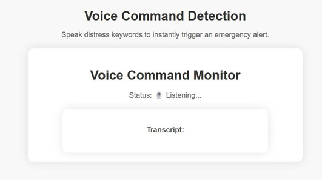
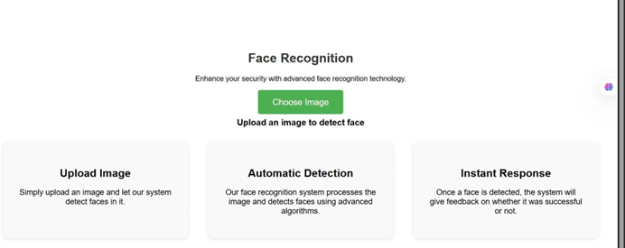
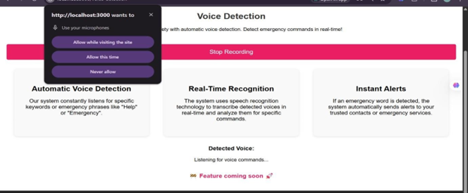
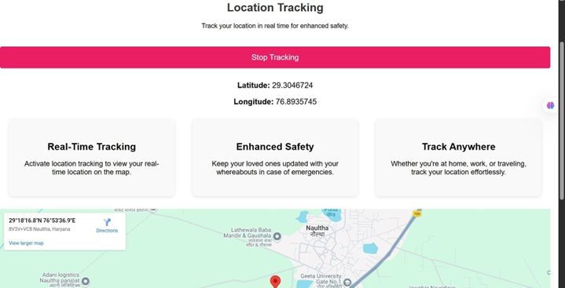
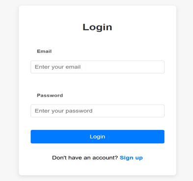
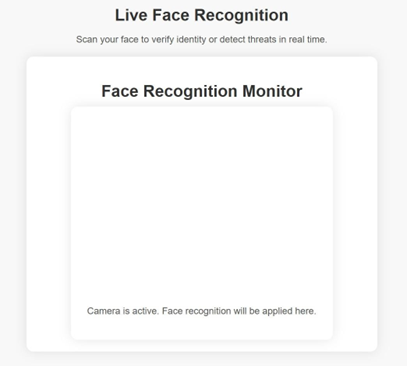

# SHEild 🛡️ - Women Safety Web Application

A full-stack women safety web application built with the MERN stack, designed to provide real-time emergency alerts and safety features for women in critical situations.

---

## 🚀 Features

- 🔐 Secure user authentication (Login / Signup)
- 🚨 Emergency alert system with real-time notifications
- 📞 Emergency contact management workflows
- ⚡ Optimized REST APIs with ~280ms response latency
- 🗄️ MongoDB with indexed queries for fast data retrieval

---

## 🛠️ Tech Stack

| Layer | Technology |
|----------|-----------|
| Frontend | React.js |
| Backend | Node.js, Express.js |
| Database | MongoDB |
| API | REST APIs |
| Auth | JWT Authentication |

---

## 📸 Screenshots










---

## ⚙️ Installation & Setup

### Prerequisites
- Node.js installed
- MongoDB running locally or MongoDB Atlas

### Steps

1. Clone the repository
\```
git clone https://github.com/rashiaggarwal06/SHEild-Women-Safety-Web-App.git
\```

2. Install backend dependencies
\```
cd backend
npm install
\```

3. Install frontend dependencies
\```
cd frontend
npm install
\```

4. Create a `.env` file in the backend folder
\```
MONGO_URI=your_mongodb_connection_string
JWT_SECRET=your_jwt_secret
\```

5. Run the backend
\```
npm start
\```

6. Run the frontend
\```
npm start
\```

---

## 📁 Project Structure

\```
SHEild/
├── backend/
│   ├── models/
│   ├── routes/
│   ├── controllers/
│   └── server.js
├── frontend/
│   ├── src/
│   └── public/
└── README.md
\```

---

## 🙋‍♀️ Contact

Made with ❤️ by **Rashi Aggarwal**

- 📧 Email: rashiaggarwalofficial@gmail.com
- 💼 LinkedIn: [linkedin.com/in/rashiaggarwal06](https://www.linkedin.com/in/rashiaggarwal06)

---

## 📄 License

This project is open source and available under the [MIT License](LICENSE).
